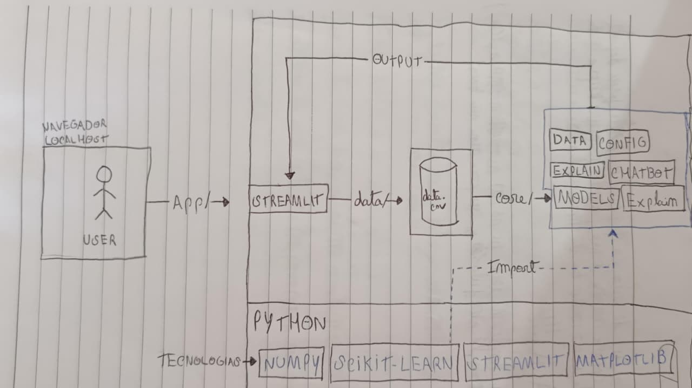

Visão em Camadas

Usuário (navegador)
   ↓
app/  → interface com Streamlit
   ↓
core/ 
   ├─ data/       → leitura/validação
   ├─ features/   → pipelines
   ├─ models/     → treino/predição
   ├─ explain/    → explicações
   └─ chatbot/    → respostas FAQ
   ↓
data/
   ├─ raw/        → dados brutos
   ├─ processed/  → dados tratados
   └─ models/     → modelos salvos

Componentes e Responsabilidades

app/

UI em Streamlit → upload de dados, seleção de tarefa (classificação ou regressão), exibição de resultados.

core/data/

Lê e valida os CSVs.

core/features/

Pipelines de transformação → imputação de valores nulos, normalização, codificação de categorias.

core/models/

Treina modelos de ML.

Para classificação: métricas como acurácia, f1, recall.

Para regressão: métricas como RMSE.

core/explain/

Explica a importância das features no modelo.

core/chatbot/

Regras para responder FAQs (ex.: "qual a métrica usada?", "qual variável mais importante?").

data/

Guarda os arquivos originais, os tratados e os modelos já treinados.

Fluxo de Execução

Usuário acessa a aplicação.

Faz upload do dataset  (data.csv).

data/ valida o schema (colunas obrigatórias).

features/ processa os dados.

models/ treina e avalia.

explain/ mostra variáveis relevantes.

chatbot/ responde perguntas.

app/ mostra métricas e gráficos.

Artefatos tratados e modelos ficam salvos em data/.
